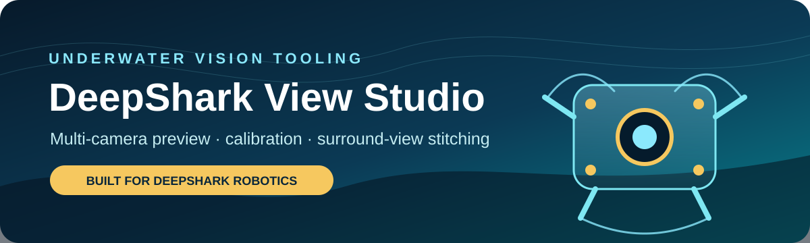
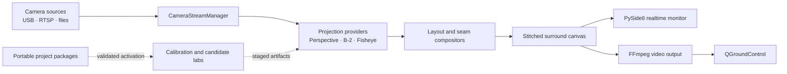

<p align="center">
  
</p>

<p align="center">
  <a href="https://github.com/KevinJiang05/DeepSharkViewStudio/actions/workflows/ci.yml"></a>
  <a href="LICENSE"></a>
  
  
  
</p>

DeepShark View Studio is a standalone desktop workbench for developing and validating multi-camera surround-view systems. It brings camera preview, source configuration, calibration, projection experiments, seam tuning, stitching, diagnostics, and QGC-oriented video output into one PySide6 application.

**中文简介：** DeepShark View Studio 是面向水下机器人多相机系统的独立桌面开发工具，覆盖相机预览、标定、投影实验、接缝调优、环视拼接、诊断和 QGC 视频输出。它可以独立安装运行，不依赖旧原型工程。

> [!IMPORTANT]
> This is an engineering and research tool. The tracked calibration is hardware-specific, and experimental candidates are deliberately kept separate from active runtime configuration.

## What it does

| Workspace | Capabilities |
| --- | --- |
| **Realtime Monitor** | Preview image directories, USB cameras, video files, or RTSP streams; inspect raw, warped, and stitched views; track camera health and effective runtime state. |
| **Layout & Projection Lab** | Author Near and Far layout candidates, compare perspective and fisheye paths, and preview changes without mutating the active calibration. |
| **Calibration** | Detect chessboard, ArUco, and ChArUco targets; estimate intrinsics; edit perspective points and seams; export quality reports. |
| **Project Management** | Export, validate, and activate portable project packages; create backups before risky calibration or seam edits. |
| **Diagnostics & Output** | Inspect redacted logs, runtime provenance, latency and health; publish an optional low-latency FFmpeg stream for QGC integration. |

Supported camera topologies range from 2 to 5 active channels. The current application exposes five explicit runtime views: Far Default, B-2 View, Far Custom, Near Current, and Near Fisheye.

## Architecture



The runtime keeps experimental candidates separate from the formal configuration. A selected view, an applied worker configuration, and the effective output state are tracked independently so the UI does not silently claim that an unapplied experiment is active.

## Quick start

Windows is the primary development target.

```powershell
py -3 -m venv .venv
.\.venv\Scripts\python.exe -m pip install -r requirements.txt
.\.venv\Scripts\python.exe app.py --initialize-configs --preflight-only
.\.venv\Scripts\python.exe app.py
```

The explicit initialization step creates only missing local `cameras.yaml` and `network.yaml` files from safe examples. It never overwrites an existing local configuration or replaces the tracked calibration.

You can also launch the application with:

```powershell
StartDeepSharkViewStudio.cmd
```

The launcher checks `DEEP_SHARK_PYTHON`, the repository-local `.venv`, the shared workspace environment, and then standard Python launchers. Every candidate interpreter must provide the full runtime dependency set.

## Image-directory demo

Place sample images in `samples/input/` using camera names in the filenames:

```text
front_left  front_right  front  behind  left  right
```

Then run:

```powershell
.\.venv\Scripts\python.exe tools\run_image_demo.py
```

The stitched canvas and warped camera views are written to `samples/output/`. Both directories are ignored so local camera imagery is not published accidentally.

## Runtime views

| View | Projection | Composition | Intended use |
| --- | --- | --- | --- |
| Far Default | Formal perspective calibration | Horizontal feather | Stable far-field baseline |
| B-2 View | B-2 per-camera candidate | Candidate weight selection | Experimental projection evaluation |
| Far Custom | B-2 candidate source | Adjustable far-field layout | Controlled layout experiments |
| Near Current | Formal perspective calibration | Front-priority near compositor | Stable near-field baseline |
| Near Fisheye | Rectilinear fisheye remap | Front-priority near compositor | Fisheye comparison and tuning |

No experimental candidate is promoted to the formal calibration merely by previewing or saving it.

## Configuration boundaries

```text
configs/
  calibration.yaml       tracked hardware calibration
  cameras.example.yaml   safe camera-source example
  network.example.yaml   safe output example
  cameras.yaml           local and ignored
  network.yaml           local and ignored
  active_project.yaml    local and ignored
```

Runtime captures, project backups, generated candidates, reports, sample imagery, logs, and UI artifacts are ignored unless deliberately selected for publication. Connection details are redacted before they reach the application log or clipboard.

## Development and tests

Install the development dependencies and run the full suite:

```powershell
.\.venv\Scripts\python.exe -m pip install -r requirements-dev.txt
$env:QT_QPA_PLATFORM = "offscreen"
.\.venv\Scripts\python.exe -m pytest -q
```

GitHub Actions runs the same suite on Windows with Python 3.12. The OpenCV dependency stays on the supported 4.x line because OpenCV 5 introduced API and detection behavior changes that require a separate compatibility pass.

## Project map

```text
DeepSharkViewStudio/
  app.py                         application entry point
  StartDeepSharkViewStudio.cmd   Windows launcher
  configs/                       tracked baseline and safe examples
  deep_shark_studio/
    gui/                         desktop UI and workflow state
    projection/                  perspective, B-2, and fisheye providers
    seam/                        layout, seam, and compositor logic
    project_package/             portable package validation and activation
    qgc/                         optional video output service
  docs/                          workflow and integration documentation
  tests/                         unit, contract, GUI, and regression tests
  tools/                         demos, benchmarks, and UI audit helpers
```

## Documentation

- [Quick start](docs/quick_start.md)
- [UI workflow](docs/ui_workflow.md)
- [Runtime view contracts](docs/stitch_runtime_modes.md)
- [Portable project packages](docs/project_package.md)
- [QGC video payload service](docs/qgc_video_payload_service.md)

The Chinese engineering reports in the repository are dated audit snapshots. They preserve the evidence and limitations observed at those stages; the current code, tests, and configuration remain authoritative.

## Related project

[QGC_for_GRobot](https://github.com/KevinJiang05/QGC_for_GRobot) is the customized QGroundControl application used by the broader DeepShark underwater robot project. DeepShark View Studio keeps calibration and surround-view development independent from the flight-control application while providing an explicit video-output bridge for integration testing.

## License

DeepShark View Studio is released under the [MIT License](LICENSE).
